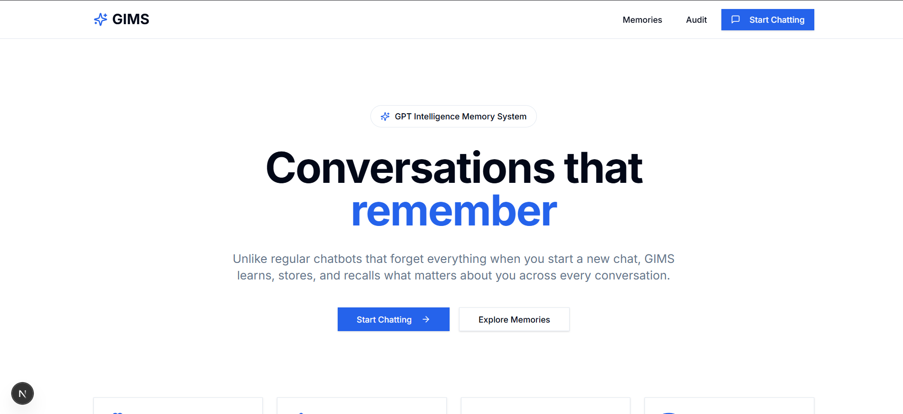
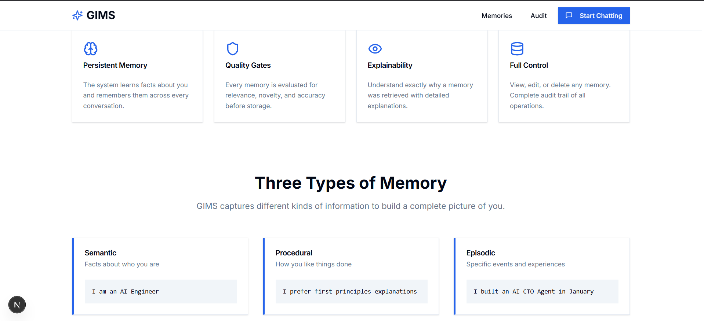
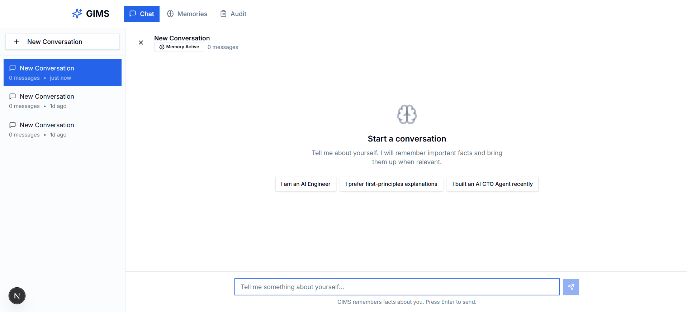
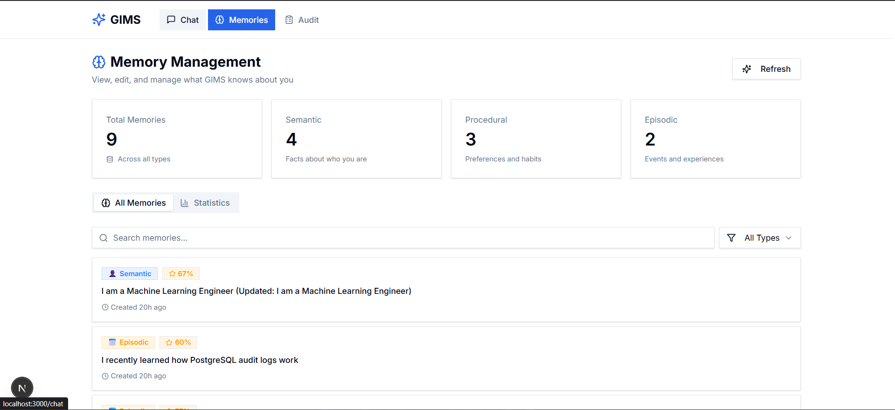
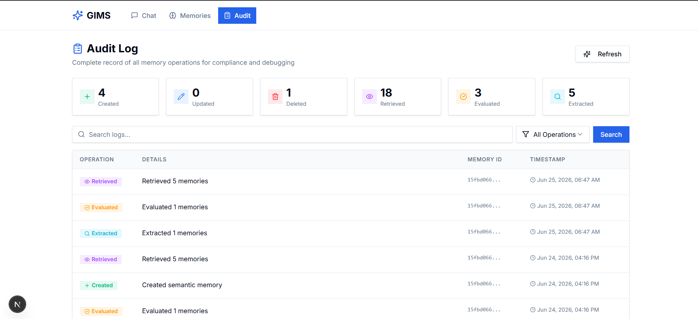

# 🧠 GPT Intelligence Memory System (GIMS)

A production-inspired memory system for AI assistants that extracts, evaluates, stores, retrieves, and explains user memories across conversations.

Built this project using FastAPI, PostgreSQL, ChromaDB, and Next.js.

---

# Features

## Memory Extraction

Extracts three types of memories:

### Semantic Memory

Facts about the user.

Example:

```text
I am a Machine Learning Engineer.
```

### Procedural Memory

Preferences and habits.

Example:

```text
I prefer first-principles explanations.
```

### Episodic Memory

Experiences, achievements, and events.

Example:

```text
I recently learned how PostgreSQL audit logs work.
```

---

## Quality Gate Evaluation

Each memory is scored on:

* Relevance
* Novelty
* Accuracy

Only high-quality memories are stored automatically.

---

## Hybrid Memory Retrieval

Combines:

* Vector Search (ChromaDB)
* Keyword Search (PostgreSQL)

to find the most relevant memories.

---

## Explainability

Shows why a memory was retrieved.

Example:

> Retrieved because the query referenced career-related topics and this memory indicates the user is a Machine Learning Engineer.

---

## Memory Governance

Users can:

* View memories
* Edit memories
* Delete memories
* Review audit logs

---

# Architecture

```text
User Message
      │
      ▼
Extractor Agent
      │
      ▼
Evaluator Agent
      │
      ▼
Memory Service
      │
 ┌────┴────┐
 ▼         ▼
Postgres  ChromaDB
      │
      ▼
Retriever Agent
      │
      ▼
Chat Response
```

---

# Tech Stack

## Frontend

* Next.js 15
* TypeScript
* TailwindCSS
* ShadCN UI
* Framer Motion

## Backend

* FastAPI
* SQLAlchemy
* AsyncPG

## Storage

### PostgreSQL

Stores:

* Memory metadata
* Scores
* Audit logs
* Conversations

### ChromaDB

Stores:

* Embeddings
* Semantic vectors

## AI

* Groq API
* Llama 3.1 8B Instant

---

# Project Structure

```text
gims/
├── backend/
├── frontend/
├── docs/
├── docker-compose.yml
└── README.md
```

---

# Environment Variables

Backend `.env`

```env
OPENAI_API_KEY=your_key
OPENAI_MODEL=llama-3.1-8b-instant

POSTGRES_HOST=localhost
POSTGRES_PORT=5432
POSTGRES_DB=gims
POSTGRES_USER=postgres
POSTGRES_PASSWORD=postgres

CHROMA_HOST=localhost
CHROMA_PORT=8001
```

Frontend `.env.local`

```env
NEXT_PUBLIC_API_BASE=http://localhost:8000
```

---

# Running with Docker

## Start PostgreSQL

```bash
docker run -d \
  --name gims-postgres \
  -e POSTGRES_USER=postgres \
  -e POSTGRES_PASSWORD=postgres \
  -e POSTGRES_DB=gims \
  -p 5432:5432 \
  postgres:16
```

## Start ChromaDB

```bash
docker run -d \
  --name gims-chroma \
  -p 8001:8000 \
  chromadb/chroma
```

Verify:

```bash
docker ps
```

Expected:

```text
postgres running on 5432
chroma running on 8001
```

---

# Running Backend

```bash
cd backend

python -m venv .venv

source .venv/bin/activate
```

Windows:

```powershell
.venv\Scripts\activate
```

Install dependencies:

```bash
pip install -r requirements.txt
```

Run database migrations:

```bash
alembic upgrade head
```

Start backend:

```bash
uvicorn main:app --reload
```

Backend:

```text
http://localhost:8000
```

Swagger Docs:

```text
http://localhost:8000/docs
```

---

# Running Frontend

```bash
cd frontend

npm install

npm run dev
```

Frontend:

```text
http://localhost:3000
```

---

# Available Pages

| Page      | Description        |
| --------- | ------------------ |
| /         | Landing Page       |
| /chat     | Chat Interface     |
| /memories | Memory Management  |
| /audit    | Audit Logs         |
| /hitl     | Human Review Queue |

---

# API Endpoints

## Chat

```http
POST /api/v1/chat
```

## Memories

```http
GET    /api/v1/memories
PUT    /api/v1/memories/{id}
DELETE /api/v1/memories/{id}
```

## Audit

```http
GET /api/v1/audit
```

## Metrics

```http
GET /api/v1/metrics
```

---

# Screenshots

Add screenshots here:

## Landing Page



---

## Chat Interface


---

## Memory Dashboard



---
## Audit Dashboard



---

# Future Improvements

* Multi-user support
* Authentication
* Memory summarization
* Memory graph relationships
* Better evaluation models
* Redis caching
* Observability dashboard
* Production deployment

---

# License

MIT License

---

Built by Jacob Jerry Arackal.
